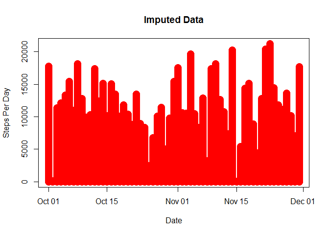
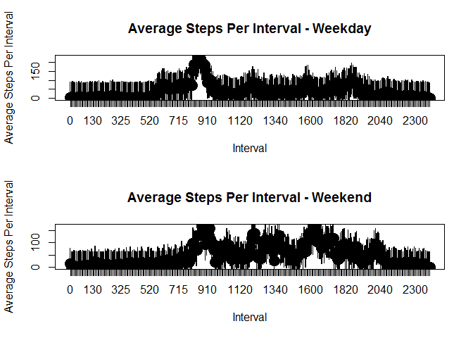

# Reproducible Research Course Project 1
A. Elgendy  
February 5, 2016  

This is an R Markdown document. Markdown is a simple formatting syntax for authoring HTML, PDF, and MS Word documents. For more details on using R Markdown see <http://rmarkdown.rstudio.com>.

When you click the **Knit** button a document will be generated that includes both content as well as the output of any embedded R code chunks within the document. You can embed an R code chunk.

##Description of Document

###Introduction:
  This document contains literate statistical programming for data about personal movement using activity monitoring devices such as a Fitbit, Nike Fuelband, or Jawbone Up. These type of devices are part of the "quantified self" movement - a group of enthusiasts who take measurements about themselves regularly to improve their health, to find patterns in their behavior, or because they are tech geeks. But these data remain under-utilized both because the raw data are hard to obtain and there is a lack of statistical methods and software for processing and interpreting the data. This document makes use of data from a personal activity monitoring device. This device collects data at 5 minute intervals through out the day. The data consists of two months of data from an anonymous individual collected during the months of October and November, 2012 and include the number of steps taken in 5 minute intervals each day.

###Study:
In the literate statistical programming below, the author answers three questions:
1. What is mean total number of steps taken per day?
2. What is the average daily activity pattern?
3. What is the impact of imputing missing values on the activity pattern?
4. Are there differences in activity patterns between weekdays and weekends?


##Description of Code

###Note about the code included: 
The code assumes that the loaded libraries used in the programming have been installed on the machine running the code. The loaded libraries are as follows:
-xtable
-Amelia
-chron

###Chunk 1: Loading and Processing Data
1. Load the data (i.e. read.csv()).
2. Process/transform the data (if necessary) into a format suitable for your analysis.


```r
data1 <- read.csv(file = "activity.csv")

data2 <- data1
data2$interval <- as.factor(data1$interval)
data2$date <- as.Date(data1$date)
```

###Chunk 2: Number of Steps Taken Everyday by Date
1. Calculate the total number of steps taken per day.
3. Make a histogram of the total number of steps taken each day.
2. Calculate and report the mean and median of the total number of steps taken per day.


```r
stepsTakenPerDay <- aggregate(steps ~ date, data = data2, FUN = sum)
stepsTakenPerDay$date <- as.Date(stepsTakenPerDay$date)
library(xtable)
displayTable <- xtable(stepsTakenPerDay)
print(displayTable, type = "html")
```

```
## Warning in formatC(x = structure(c(15615, 15616, 15617, 15618, 15619,
## 15620, : class of 'x' was discarded
```

<!-- html table generated in R 3.2.3 by xtable 1.8-2 package -->
<!-- Sun Feb 07 00:54:05 2016 -->
<table border=1>
<tr> <th>  </th> <th> date </th> <th> steps </th>  </tr>
  <tr> <td align="right"> 1 </td> <td align="right"> 15615.00 </td> <td align="right"> 126 </td> </tr>
  <tr> <td align="right"> 2 </td> <td align="right"> 15616.00 </td> <td align="right"> 11352 </td> </tr>
  <tr> <td align="right"> 3 </td> <td align="right"> 15617.00 </td> <td align="right"> 12116 </td> </tr>
  <tr> <td align="right"> 4 </td> <td align="right"> 15618.00 </td> <td align="right"> 13294 </td> </tr>
  <tr> <td align="right"> 5 </td> <td align="right"> 15619.00 </td> <td align="right"> 15420 </td> </tr>
  <tr> <td align="right"> 6 </td> <td align="right"> 15620.00 </td> <td align="right"> 11015 </td> </tr>
  <tr> <td align="right"> 7 </td> <td align="right"> 15622.00 </td> <td align="right"> 12811 </td> </tr>
  <tr> <td align="right"> 8 </td> <td align="right"> 15623.00 </td> <td align="right"> 9900 </td> </tr>
  <tr> <td align="right"> 9 </td> <td align="right"> 15624.00 </td> <td align="right"> 10304 </td> </tr>
  <tr> <td align="right"> 10 </td> <td align="right"> 15625.00 </td> <td align="right"> 17382 </td> </tr>
  <tr> <td align="right"> 11 </td> <td align="right"> 15626.00 </td> <td align="right"> 12426 </td> </tr>
  <tr> <td align="right"> 12 </td> <td align="right"> 15627.00 </td> <td align="right"> 15098 </td> </tr>
  <tr> <td align="right"> 13 </td> <td align="right"> 15628.00 </td> <td align="right"> 10139 </td> </tr>
  <tr> <td align="right"> 14 </td> <td align="right"> 15629.00 </td> <td align="right"> 15084 </td> </tr>
  <tr> <td align="right"> 15 </td> <td align="right"> 15630.00 </td> <td align="right"> 13452 </td> </tr>
  <tr> <td align="right"> 16 </td> <td align="right"> 15631.00 </td> <td align="right"> 10056 </td> </tr>
  <tr> <td align="right"> 17 </td> <td align="right"> 15632.00 </td> <td align="right"> 11829 </td> </tr>
  <tr> <td align="right"> 18 </td> <td align="right"> 15633.00 </td> <td align="right"> 10395 </td> </tr>
  <tr> <td align="right"> 19 </td> <td align="right"> 15634.00 </td> <td align="right"> 8821 </td> </tr>
  <tr> <td align="right"> 20 </td> <td align="right"> 15635.00 </td> <td align="right"> 13460 </td> </tr>
  <tr> <td align="right"> 21 </td> <td align="right"> 15636.00 </td> <td align="right"> 8918 </td> </tr>
  <tr> <td align="right"> 22 </td> <td align="right"> 15637.00 </td> <td align="right"> 8355 </td> </tr>
  <tr> <td align="right"> 23 </td> <td align="right"> 15638.00 </td> <td align="right"> 2492 </td> </tr>
  <tr> <td align="right"> 24 </td> <td align="right"> 15639.00 </td> <td align="right"> 6778 </td> </tr>
  <tr> <td align="right"> 25 </td> <td align="right"> 15640.00 </td> <td align="right"> 10119 </td> </tr>
  <tr> <td align="right"> 26 </td> <td align="right"> 15641.00 </td> <td align="right"> 11458 </td> </tr>
  <tr> <td align="right"> 27 </td> <td align="right"> 15642.00 </td> <td align="right"> 5018 </td> </tr>
  <tr> <td align="right"> 28 </td> <td align="right"> 15643.00 </td> <td align="right"> 9819 </td> </tr>
  <tr> <td align="right"> 29 </td> <td align="right"> 15644.00 </td> <td align="right"> 15414 </td> </tr>
  <tr> <td align="right"> 30 </td> <td align="right"> 15646.00 </td> <td align="right"> 10600 </td> </tr>
  <tr> <td align="right"> 31 </td> <td align="right"> 15647.00 </td> <td align="right"> 10571 </td> </tr>
  <tr> <td align="right"> 32 </td> <td align="right"> 15649.00 </td> <td align="right"> 10439 </td> </tr>
  <tr> <td align="right"> 33 </td> <td align="right"> 15650.00 </td> <td align="right"> 8334 </td> </tr>
  <tr> <td align="right"> 34 </td> <td align="right"> 15651.00 </td> <td align="right"> 12883 </td> </tr>
  <tr> <td align="right"> 35 </td> <td align="right"> 15652.00 </td> <td align="right"> 3219 </td> </tr>
  <tr> <td align="right"> 36 </td> <td align="right"> 15655.00 </td> <td align="right"> 12608 </td> </tr>
  <tr> <td align="right"> 37 </td> <td align="right"> 15656.00 </td> <td align="right"> 10765 </td> </tr>
  <tr> <td align="right"> 38 </td> <td align="right"> 15657.00 </td> <td align="right"> 7336 </td> </tr>
  <tr> <td align="right"> 39 </td> <td align="right"> 15659.00 </td> <td align="right">  41 </td> </tr>
  <tr> <td align="right"> 40 </td> <td align="right"> 15660.00 </td> <td align="right"> 5441 </td> </tr>
  <tr> <td align="right"> 41 </td> <td align="right"> 15661.00 </td> <td align="right"> 14339 </td> </tr>
  <tr> <td align="right"> 42 </td> <td align="right"> 15662.00 </td> <td align="right"> 15110 </td> </tr>
  <tr> <td align="right"> 43 </td> <td align="right"> 15663.00 </td> <td align="right"> 8841 </td> </tr>
  <tr> <td align="right"> 44 </td> <td align="right"> 15664.00 </td> <td align="right"> 4472 </td> </tr>
  <tr> <td align="right"> 45 </td> <td align="right"> 15665.00 </td> <td align="right"> 12787 </td> </tr>
  <tr> <td align="right"> 46 </td> <td align="right"> 15666.00 </td> <td align="right"> 20427 </td> </tr>
  <tr> <td align="right"> 47 </td> <td align="right"> 15667.00 </td> <td align="right"> 21194 </td> </tr>
  <tr> <td align="right"> 48 </td> <td align="right"> 15668.00 </td> <td align="right"> 14478 </td> </tr>
  <tr> <td align="right"> 49 </td> <td align="right"> 15669.00 </td> <td align="right"> 11834 </td> </tr>
  <tr> <td align="right"> 50 </td> <td align="right"> 15670.00 </td> <td align="right"> 11162 </td> </tr>
  <tr> <td align="right"> 51 </td> <td align="right"> 15671.00 </td> <td align="right"> 13646 </td> </tr>
  <tr> <td align="right"> 52 </td> <td align="right"> 15672.00 </td> <td align="right"> 10183 </td> </tr>
  <tr> <td align="right"> 53 </td> <td align="right"> 15673.00 </td> <td align="right"> 7047 </td> </tr>
   </table>

```r
plot(x = stepsTakenPerDay$date, y = stepsTakenPerDay$steps , type = "h", xlab = "Date", ylab = "Steps Per Day", lwd = 15, col = "green")
```


```r
meanStepsTakenPerDay <- aggregate(steps ~ date, data = data2, FUN = mean)
colnames(meanStepsTakenPerDay)[2] <- "steps.Mean"
meanStepsTakenPerDayTable <- xtable((meanStepsTakenPerDay))
print(meanStepsTakenPerDayTable, type = "html")
```

```
## Warning in formatC(x = structure(c(15615, 15616, 15617, 15618, 15619,
## 15620, : class of 'x' was discarded
```

<!-- html table generated in R 3.2.3 by xtable 1.8-2 package -->
<!-- Sun Feb 07 00:54:05 2016 -->
<table border=1>
<tr> <th>  </th> <th> date </th> <th> steps.Mean </th>  </tr>
  <tr> <td align="right"> 1 </td> <td align="right"> 15615.00 </td> <td align="right"> 0.44 </td> </tr>
  <tr> <td align="right"> 2 </td> <td align="right"> 15616.00 </td> <td align="right"> 39.42 </td> </tr>
  <tr> <td align="right"> 3 </td> <td align="right"> 15617.00 </td> <td align="right"> 42.07 </td> </tr>
  <tr> <td align="right"> 4 </td> <td align="right"> 15618.00 </td> <td align="right"> 46.16 </td> </tr>
  <tr> <td align="right"> 5 </td> <td align="right"> 15619.00 </td> <td align="right"> 53.54 </td> </tr>
  <tr> <td align="right"> 6 </td> <td align="right"> 15620.00 </td> <td align="right"> 38.25 </td> </tr>
  <tr> <td align="right"> 7 </td> <td align="right"> 15622.00 </td> <td align="right"> 44.48 </td> </tr>
  <tr> <td align="right"> 8 </td> <td align="right"> 15623.00 </td> <td align="right"> 34.38 </td> </tr>
  <tr> <td align="right"> 9 </td> <td align="right"> 15624.00 </td> <td align="right"> 35.78 </td> </tr>
  <tr> <td align="right"> 10 </td> <td align="right"> 15625.00 </td> <td align="right"> 60.35 </td> </tr>
  <tr> <td align="right"> 11 </td> <td align="right"> 15626.00 </td> <td align="right"> 43.15 </td> </tr>
  <tr> <td align="right"> 12 </td> <td align="right"> 15627.00 </td> <td align="right"> 52.42 </td> </tr>
  <tr> <td align="right"> 13 </td> <td align="right"> 15628.00 </td> <td align="right"> 35.20 </td> </tr>
  <tr> <td align="right"> 14 </td> <td align="right"> 15629.00 </td> <td align="right"> 52.38 </td> </tr>
  <tr> <td align="right"> 15 </td> <td align="right"> 15630.00 </td> <td align="right"> 46.71 </td> </tr>
  <tr> <td align="right"> 16 </td> <td align="right"> 15631.00 </td> <td align="right"> 34.92 </td> </tr>
  <tr> <td align="right"> 17 </td> <td align="right"> 15632.00 </td> <td align="right"> 41.07 </td> </tr>
  <tr> <td align="right"> 18 </td> <td align="right"> 15633.00 </td> <td align="right"> 36.09 </td> </tr>
  <tr> <td align="right"> 19 </td> <td align="right"> 15634.00 </td> <td align="right"> 30.63 </td> </tr>
  <tr> <td align="right"> 20 </td> <td align="right"> 15635.00 </td> <td align="right"> 46.74 </td> </tr>
  <tr> <td align="right"> 21 </td> <td align="right"> 15636.00 </td> <td align="right"> 30.97 </td> </tr>
  <tr> <td align="right"> 22 </td> <td align="right"> 15637.00 </td> <td align="right"> 29.01 </td> </tr>
  <tr> <td align="right"> 23 </td> <td align="right"> 15638.00 </td> <td align="right"> 8.65 </td> </tr>
  <tr> <td align="right"> 24 </td> <td align="right"> 15639.00 </td> <td align="right"> 23.53 </td> </tr>
  <tr> <td align="right"> 25 </td> <td align="right"> 15640.00 </td> <td align="right"> 35.14 </td> </tr>
  <tr> <td align="right"> 26 </td> <td align="right"> 15641.00 </td> <td align="right"> 39.78 </td> </tr>
  <tr> <td align="right"> 27 </td> <td align="right"> 15642.00 </td> <td align="right"> 17.42 </td> </tr>
  <tr> <td align="right"> 28 </td> <td align="right"> 15643.00 </td> <td align="right"> 34.09 </td> </tr>
  <tr> <td align="right"> 29 </td> <td align="right"> 15644.00 </td> <td align="right"> 53.52 </td> </tr>
  <tr> <td align="right"> 30 </td> <td align="right"> 15646.00 </td> <td align="right"> 36.81 </td> </tr>
  <tr> <td align="right"> 31 </td> <td align="right"> 15647.00 </td> <td align="right"> 36.70 </td> </tr>
  <tr> <td align="right"> 32 </td> <td align="right"> 15649.00 </td> <td align="right"> 36.25 </td> </tr>
  <tr> <td align="right"> 33 </td> <td align="right"> 15650.00 </td> <td align="right"> 28.94 </td> </tr>
  <tr> <td align="right"> 34 </td> <td align="right"> 15651.00 </td> <td align="right"> 44.73 </td> </tr>
  <tr> <td align="right"> 35 </td> <td align="right"> 15652.00 </td> <td align="right"> 11.18 </td> </tr>
  <tr> <td align="right"> 36 </td> <td align="right"> 15655.00 </td> <td align="right"> 43.78 </td> </tr>
  <tr> <td align="right"> 37 </td> <td align="right"> 15656.00 </td> <td align="right"> 37.38 </td> </tr>
  <tr> <td align="right"> 38 </td> <td align="right"> 15657.00 </td> <td align="right"> 25.47 </td> </tr>
  <tr> <td align="right"> 39 </td> <td align="right"> 15659.00 </td> <td align="right"> 0.14 </td> </tr>
  <tr> <td align="right"> 40 </td> <td align="right"> 15660.00 </td> <td align="right"> 18.89 </td> </tr>
  <tr> <td align="right"> 41 </td> <td align="right"> 15661.00 </td> <td align="right"> 49.79 </td> </tr>
  <tr> <td align="right"> 42 </td> <td align="right"> 15662.00 </td> <td align="right"> 52.47 </td> </tr>
  <tr> <td align="right"> 43 </td> <td align="right"> 15663.00 </td> <td align="right"> 30.70 </td> </tr>
  <tr> <td align="right"> 44 </td> <td align="right"> 15664.00 </td> <td align="right"> 15.53 </td> </tr>
  <tr> <td align="right"> 45 </td> <td align="right"> 15665.00 </td> <td align="right"> 44.40 </td> </tr>
  <tr> <td align="right"> 46 </td> <td align="right"> 15666.00 </td> <td align="right"> 70.93 </td> </tr>
  <tr> <td align="right"> 47 </td> <td align="right"> 15667.00 </td> <td align="right"> 73.59 </td> </tr>
  <tr> <td align="right"> 48 </td> <td align="right"> 15668.00 </td> <td align="right"> 50.27 </td> </tr>
  <tr> <td align="right"> 49 </td> <td align="right"> 15669.00 </td> <td align="right"> 41.09 </td> </tr>
  <tr> <td align="right"> 50 </td> <td align="right"> 15670.00 </td> <td align="right"> 38.76 </td> </tr>
  <tr> <td align="right"> 51 </td> <td align="right"> 15671.00 </td> <td align="right"> 47.38 </td> </tr>
  <tr> <td align="right"> 52 </td> <td align="right"> 15672.00 </td> <td align="right"> 35.36 </td> </tr>
  <tr> <td align="right"> 53 </td> <td align="right"> 15673.00 </td> <td align="right"> 24.47 </td> </tr>
   </table>

```r
medianStepsTakenPerDay <- aggregate(steps ~ date, data = data2, FUN = median)
colnames(medianStepsTakenPerDay)[2] <- "steps.Median"
medianStepsTakenPerDayTable <- xtable((medianStepsTakenPerDay))
print(medianStepsTakenPerDayTable, type = "html")
```

```
## Warning in formatC(x = structure(c(15615, 15616, 15617, 15618, 15619,
## 15620, : class of 'x' was discarded
```

<!-- html table generated in R 3.2.3 by xtable 1.8-2 package -->
<!-- Sun Feb 07 00:54:05 2016 -->
<table border=1>
<tr> <th>  </th> <th> date </th> <th> steps.Median </th>  </tr>
  <tr> <td align="right"> 1 </td> <td align="right"> 15615.00 </td> <td align="right"> 0.00 </td> </tr>
  <tr> <td align="right"> 2 </td> <td align="right"> 15616.00 </td> <td align="right"> 0.00 </td> </tr>
  <tr> <td align="right"> 3 </td> <td align="right"> 15617.00 </td> <td align="right"> 0.00 </td> </tr>
  <tr> <td align="right"> 4 </td> <td align="right"> 15618.00 </td> <td align="right"> 0.00 </td> </tr>
  <tr> <td align="right"> 5 </td> <td align="right"> 15619.00 </td> <td align="right"> 0.00 </td> </tr>
  <tr> <td align="right"> 6 </td> <td align="right"> 15620.00 </td> <td align="right"> 0.00 </td> </tr>
  <tr> <td align="right"> 7 </td> <td align="right"> 15622.00 </td> <td align="right"> 0.00 </td> </tr>
  <tr> <td align="right"> 8 </td> <td align="right"> 15623.00 </td> <td align="right"> 0.00 </td> </tr>
  <tr> <td align="right"> 9 </td> <td align="right"> 15624.00 </td> <td align="right"> 0.00 </td> </tr>
  <tr> <td align="right"> 10 </td> <td align="right"> 15625.00 </td> <td align="right"> 0.00 </td> </tr>
  <tr> <td align="right"> 11 </td> <td align="right"> 15626.00 </td> <td align="right"> 0.00 </td> </tr>
  <tr> <td align="right"> 12 </td> <td align="right"> 15627.00 </td> <td align="right"> 0.00 </td> </tr>
  <tr> <td align="right"> 13 </td> <td align="right"> 15628.00 </td> <td align="right"> 0.00 </td> </tr>
  <tr> <td align="right"> 14 </td> <td align="right"> 15629.00 </td> <td align="right"> 0.00 </td> </tr>
  <tr> <td align="right"> 15 </td> <td align="right"> 15630.00 </td> <td align="right"> 0.00 </td> </tr>
  <tr> <td align="right"> 16 </td> <td align="right"> 15631.00 </td> <td align="right"> 0.00 </td> </tr>
  <tr> <td align="right"> 17 </td> <td align="right"> 15632.00 </td> <td align="right"> 0.00 </td> </tr>
  <tr> <td align="right"> 18 </td> <td align="right"> 15633.00 </td> <td align="right"> 0.00 </td> </tr>
  <tr> <td align="right"> 19 </td> <td align="right"> 15634.00 </td> <td align="right"> 0.00 </td> </tr>
  <tr> <td align="right"> 20 </td> <td align="right"> 15635.00 </td> <td align="right"> 0.00 </td> </tr>
  <tr> <td align="right"> 21 </td> <td align="right"> 15636.00 </td> <td align="right"> 0.00 </td> </tr>
  <tr> <td align="right"> 22 </td> <td align="right"> 15637.00 </td> <td align="right"> 0.00 </td> </tr>
  <tr> <td align="right"> 23 </td> <td align="right"> 15638.00 </td> <td align="right"> 0.00 </td> </tr>
  <tr> <td align="right"> 24 </td> <td align="right"> 15639.00 </td> <td align="right"> 0.00 </td> </tr>
  <tr> <td align="right"> 25 </td> <td align="right"> 15640.00 </td> <td align="right"> 0.00 </td> </tr>
  <tr> <td align="right"> 26 </td> <td align="right"> 15641.00 </td> <td align="right"> 0.00 </td> </tr>
  <tr> <td align="right"> 27 </td> <td align="right"> 15642.00 </td> <td align="right"> 0.00 </td> </tr>
  <tr> <td align="right"> 28 </td> <td align="right"> 15643.00 </td> <td align="right"> 0.00 </td> </tr>
  <tr> <td align="right"> 29 </td> <td align="right"> 15644.00 </td> <td align="right"> 0.00 </td> </tr>
  <tr> <td align="right"> 30 </td> <td align="right"> 15646.00 </td> <td align="right"> 0.00 </td> </tr>
  <tr> <td align="right"> 31 </td> <td align="right"> 15647.00 </td> <td align="right"> 0.00 </td> </tr>
  <tr> <td align="right"> 32 </td> <td align="right"> 15649.00 </td> <td align="right"> 0.00 </td> </tr>
  <tr> <td align="right"> 33 </td> <td align="right"> 15650.00 </td> <td align="right"> 0.00 </td> </tr>
  <tr> <td align="right"> 34 </td> <td align="right"> 15651.00 </td> <td align="right"> 0.00 </td> </tr>
  <tr> <td align="right"> 35 </td> <td align="right"> 15652.00 </td> <td align="right"> 0.00 </td> </tr>
  <tr> <td align="right"> 36 </td> <td align="right"> 15655.00 </td> <td align="right"> 0.00 </td> </tr>
  <tr> <td align="right"> 37 </td> <td align="right"> 15656.00 </td> <td align="right"> 0.00 </td> </tr>
  <tr> <td align="right"> 38 </td> <td align="right"> 15657.00 </td> <td align="right"> 0.00 </td> </tr>
  <tr> <td align="right"> 39 </td> <td align="right"> 15659.00 </td> <td align="right"> 0.00 </td> </tr>
  <tr> <td align="right"> 40 </td> <td align="right"> 15660.00 </td> <td align="right"> 0.00 </td> </tr>
  <tr> <td align="right"> 41 </td> <td align="right"> 15661.00 </td> <td align="right"> 0.00 </td> </tr>
  <tr> <td align="right"> 42 </td> <td align="right"> 15662.00 </td> <td align="right"> 0.00 </td> </tr>
  <tr> <td align="right"> 43 </td> <td align="right"> 15663.00 </td> <td align="right"> 0.00 </td> </tr>
  <tr> <td align="right"> 44 </td> <td align="right"> 15664.00 </td> <td align="right"> 0.00 </td> </tr>
  <tr> <td align="right"> 45 </td> <td align="right"> 15665.00 </td> <td align="right"> 0.00 </td> </tr>
  <tr> <td align="right"> 46 </td> <td align="right"> 15666.00 </td> <td align="right"> 0.00 </td> </tr>
  <tr> <td align="right"> 47 </td> <td align="right"> 15667.00 </td> <td align="right"> 0.00 </td> </tr>
  <tr> <td align="right"> 48 </td> <td align="right"> 15668.00 </td> <td align="right"> 0.00 </td> </tr>
  <tr> <td align="right"> 49 </td> <td align="right"> 15669.00 </td> <td align="right"> 0.00 </td> </tr>
  <tr> <td align="right"> 50 </td> <td align="right"> 15670.00 </td> <td align="right"> 0.00 </td> </tr>
  <tr> <td align="right"> 51 </td> <td align="right"> 15671.00 </td> <td align="right"> 0.00 </td> </tr>
  <tr> <td align="right"> 52 </td> <td align="right"> 15672.00 </td> <td align="right"> 0.00 </td> </tr>
  <tr> <td align="right"> 53 </td> <td align="right"> 15673.00 </td> <td align="right"> 0.00 </td> </tr>
   </table>

###Chunk 3: Average Daily Activity Pattern
1. Make a time series plot (i.e. type = "l") of the 5-minute interval (x-axis) and the average number of steps taken, averaged across all days (y-axis).
2. Which 5-minute interval, on average across all the days in the dataset, contains the maximum number of steps?

```r
meanStepsTakenPerInterval <- aggregate(steps ~ interval, data = data2, FUN = mean)
colnames(meanStepsTakenPerInterval)[2] <- "steps.Mean"
plot(x = meanStepsTakenPerInterval$interval, y = meanStepsTakenPerInterval$steps.Mean , type = "l", xlab = "Interval", ylab = "Steps Mean Per Interval", col = "green", main = "Before-Imputation Data")
```


```r
displayTable2 <- meanStepsTakenPerInterval[meanStepsTakenPerInterval$steps.Mean==max(meanStepsTakenPerInterval$steps.Mean,na.rm = TRUE),]
print(displayTable2, type = "html")
```

    interval steps.Mean
104      835   206.1698

###Chunk 4: Imputing Missing Values and Activity Pattern
1. Calculate and report the total number of missing values in the dataset (i.e. the total number of rows with NAs)
2. Predictive strategy for filling in all of the missing values in the dataset. Create a new dataset that is equal to the original dataset but with the missing data filled in.
3. Make a histogram of the total number of steps taken each day and Calculate and report the mean and median total number of steps taken per day.


```r
missingValues <- sum(complete.cases(data2))
missingValuesTable <- xtable(table(missingValues))
print(missingValuesTable)
```

% latex table generated in R 3.2.3 by xtable 1.8-2 package
% Sun Feb 07 00:54:06 2016
\begin{table}[ht]
\centering
\begin{tabular}{rr}
  \hline
 & missingValues \\ 
  \hline
15264 &   1 \\ 
   \hline
\end{tabular}
\end{table}

```r
library(Amelia)
imputedData2List <- amelia(data2, m = 3, ords = "steps", noms = "interval")
```

```
## Warning in amcheck(x = x, m = m, idvars = numopts$idvars, priors = priors, : 
## 
## The number of categories in one of the variables marked nominal has greater than 10 categories. Check nominal specification.
```

-- Imputation 1 --

  1  2

-- Imputation 2 --

  1  2

-- Imputation 3 --

  1  2

```r
imputedData2 <- imputedData2List$imputations[[1]]
sum(is.na(imputedData2$imputations[[1]]$steps))
```

```
## Warning in is.na(imputedData2$imputations[[1]]$steps): is.na() applied to
## non-(list or vector) of type 'NULL'
```

[1] 0

```r
stepsTakenPerDayAfterImputation <- aggregate(steps ~ date, data = imputedData2, FUN = sum)
plot(x = stepsTakenPerDayAfterImputation$date, y = stepsTakenPerDayAfterImputation$steps , type = "h", xlab = "Date", ylab = "Steps Per Day", lwd = 15, col = "red", main = "Imputed Data")
```



```r
meanStepsTakenPerDayAfterImputation <- aggregate(steps ~ date, data = data2, FUN = mean)
colnames(meanStepsTakenPerDayAfterImputation)[2] <- "steps.Mean"
medianStepsTakenPerDayAfterImputation <- aggregate(steps ~ date, data = imputedData2, FUN = median)
colnames(medianStepsTakenPerDayAfterImputation)[2] <- "steps.Median"
displayTable3 <- xtable(meanStepsTakenPerDayAfterImputation)
displayTable4 <- xtable(medianStepsTakenPerDayAfterImputation)
print(displayTable3, type="html")
```

```
## Warning in formatC(x = structure(c(15615, 15616, 15617, 15618, 15619,
## 15620, : class of 'x' was discarded
```

<!-- html table generated in R 3.2.3 by xtable 1.8-2 package -->
<!-- Sun Feb 07 00:54:58 2016 -->
<table border=1>
<tr> <th>  </th> <th> date </th> <th> steps.Mean </th>  </tr>
  <tr> <td align="right"> 1 </td> <td align="right"> 15615.00 </td> <td align="right"> 0.44 </td> </tr>
  <tr> <td align="right"> 2 </td> <td align="right"> 15616.00 </td> <td align="right"> 39.42 </td> </tr>
  <tr> <td align="right"> 3 </td> <td align="right"> 15617.00 </td> <td align="right"> 42.07 </td> </tr>
  <tr> <td align="right"> 4 </td> <td align="right"> 15618.00 </td> <td align="right"> 46.16 </td> </tr>
  <tr> <td align="right"> 5 </td> <td align="right"> 15619.00 </td> <td align="right"> 53.54 </td> </tr>
  <tr> <td align="right"> 6 </td> <td align="right"> 15620.00 </td> <td align="right"> 38.25 </td> </tr>
  <tr> <td align="right"> 7 </td> <td align="right"> 15622.00 </td> <td align="right"> 44.48 </td> </tr>
  <tr> <td align="right"> 8 </td> <td align="right"> 15623.00 </td> <td align="right"> 34.38 </td> </tr>
  <tr> <td align="right"> 9 </td> <td align="right"> 15624.00 </td> <td align="right"> 35.78 </td> </tr>
  <tr> <td align="right"> 10 </td> <td align="right"> 15625.00 </td> <td align="right"> 60.35 </td> </tr>
  <tr> <td align="right"> 11 </td> <td align="right"> 15626.00 </td> <td align="right"> 43.15 </td> </tr>
  <tr> <td align="right"> 12 </td> <td align="right"> 15627.00 </td> <td align="right"> 52.42 </td> </tr>
  <tr> <td align="right"> 13 </td> <td align="right"> 15628.00 </td> <td align="right"> 35.20 </td> </tr>
  <tr> <td align="right"> 14 </td> <td align="right"> 15629.00 </td> <td align="right"> 52.38 </td> </tr>
  <tr> <td align="right"> 15 </td> <td align="right"> 15630.00 </td> <td align="right"> 46.71 </td> </tr>
  <tr> <td align="right"> 16 </td> <td align="right"> 15631.00 </td> <td align="right"> 34.92 </td> </tr>
  <tr> <td align="right"> 17 </td> <td align="right"> 15632.00 </td> <td align="right"> 41.07 </td> </tr>
  <tr> <td align="right"> 18 </td> <td align="right"> 15633.00 </td> <td align="right"> 36.09 </td> </tr>
  <tr> <td align="right"> 19 </td> <td align="right"> 15634.00 </td> <td align="right"> 30.63 </td> </tr>
  <tr> <td align="right"> 20 </td> <td align="right"> 15635.00 </td> <td align="right"> 46.74 </td> </tr>
  <tr> <td align="right"> 21 </td> <td align="right"> 15636.00 </td> <td align="right"> 30.97 </td> </tr>
  <tr> <td align="right"> 22 </td> <td align="right"> 15637.00 </td> <td align="right"> 29.01 </td> </tr>
  <tr> <td align="right"> 23 </td> <td align="right"> 15638.00 </td> <td align="right"> 8.65 </td> </tr>
  <tr> <td align="right"> 24 </td> <td align="right"> 15639.00 </td> <td align="right"> 23.53 </td> </tr>
  <tr> <td align="right"> 25 </td> <td align="right"> 15640.00 </td> <td align="right"> 35.14 </td> </tr>
  <tr> <td align="right"> 26 </td> <td align="right"> 15641.00 </td> <td align="right"> 39.78 </td> </tr>
  <tr> <td align="right"> 27 </td> <td align="right"> 15642.00 </td> <td align="right"> 17.42 </td> </tr>
  <tr> <td align="right"> 28 </td> <td align="right"> 15643.00 </td> <td align="right"> 34.09 </td> </tr>
  <tr> <td align="right"> 29 </td> <td align="right"> 15644.00 </td> <td align="right"> 53.52 </td> </tr>
  <tr> <td align="right"> 30 </td> <td align="right"> 15646.00 </td> <td align="right"> 36.81 </td> </tr>
  <tr> <td align="right"> 31 </td> <td align="right"> 15647.00 </td> <td align="right"> 36.70 </td> </tr>
  <tr> <td align="right"> 32 </td> <td align="right"> 15649.00 </td> <td align="right"> 36.25 </td> </tr>
  <tr> <td align="right"> 33 </td> <td align="right"> 15650.00 </td> <td align="right"> 28.94 </td> </tr>
  <tr> <td align="right"> 34 </td> <td align="right"> 15651.00 </td> <td align="right"> 44.73 </td> </tr>
  <tr> <td align="right"> 35 </td> <td align="right"> 15652.00 </td> <td align="right"> 11.18 </td> </tr>
  <tr> <td align="right"> 36 </td> <td align="right"> 15655.00 </td> <td align="right"> 43.78 </td> </tr>
  <tr> <td align="right"> 37 </td> <td align="right"> 15656.00 </td> <td align="right"> 37.38 </td> </tr>
  <tr> <td align="right"> 38 </td> <td align="right"> 15657.00 </td> <td align="right"> 25.47 </td> </tr>
  <tr> <td align="right"> 39 </td> <td align="right"> 15659.00 </td> <td align="right"> 0.14 </td> </tr>
  <tr> <td align="right"> 40 </td> <td align="right"> 15660.00 </td> <td align="right"> 18.89 </td> </tr>
  <tr> <td align="right"> 41 </td> <td align="right"> 15661.00 </td> <td align="right"> 49.79 </td> </tr>
  <tr> <td align="right"> 42 </td> <td align="right"> 15662.00 </td> <td align="right"> 52.47 </td> </tr>
  <tr> <td align="right"> 43 </td> <td align="right"> 15663.00 </td> <td align="right"> 30.70 </td> </tr>
  <tr> <td align="right"> 44 </td> <td align="right"> 15664.00 </td> <td align="right"> 15.53 </td> </tr>
  <tr> <td align="right"> 45 </td> <td align="right"> 15665.00 </td> <td align="right"> 44.40 </td> </tr>
  <tr> <td align="right"> 46 </td> <td align="right"> 15666.00 </td> <td align="right"> 70.93 </td> </tr>
  <tr> <td align="right"> 47 </td> <td align="right"> 15667.00 </td> <td align="right"> 73.59 </td> </tr>
  <tr> <td align="right"> 48 </td> <td align="right"> 15668.00 </td> <td align="right"> 50.27 </td> </tr>
  <tr> <td align="right"> 49 </td> <td align="right"> 15669.00 </td> <td align="right"> 41.09 </td> </tr>
  <tr> <td align="right"> 50 </td> <td align="right"> 15670.00 </td> <td align="right"> 38.76 </td> </tr>
  <tr> <td align="right"> 51 </td> <td align="right"> 15671.00 </td> <td align="right"> 47.38 </td> </tr>
  <tr> <td align="right"> 52 </td> <td align="right"> 15672.00 </td> <td align="right"> 35.36 </td> </tr>
  <tr> <td align="right"> 53 </td> <td align="right"> 15673.00 </td> <td align="right"> 24.47 </td> </tr>
   </table>

```r
print(displayTable4, type="html")
```

```
## Warning in formatC(x = structure(c(15614, 15615, 15616, 15617, 15618,
## 15619, : class of 'x' was discarded
```

<!-- html table generated in R 3.2.3 by xtable 1.8-2 package -->
<!-- Sun Feb 07 00:54:58 2016 -->
<table border=1>
<tr> <th>  </th> <th> date </th> <th> steps.Median </th>  </tr>
  <tr> <td align="right"> 1 </td> <td align="right"> 15614.00 </td> <td align="right"> 32.00 </td> </tr>
  <tr> <td align="right"> 2 </td> <td align="right"> 15615.00 </td> <td align="right"> 0.00 </td> </tr>
  <tr> <td align="right"> 3 </td> <td align="right"> 15616.00 </td> <td align="right"> 0.00 </td> </tr>
  <tr> <td align="right"> 4 </td> <td align="right"> 15617.00 </td> <td align="right"> 0.00 </td> </tr>
  <tr> <td align="right"> 5 </td> <td align="right"> 15618.00 </td> <td align="right"> 0.00 </td> </tr>
  <tr> <td align="right"> 6 </td> <td align="right"> 15619.00 </td> <td align="right"> 0.00 </td> </tr>
  <tr> <td align="right"> 7 </td> <td align="right"> 15620.00 </td> <td align="right"> 0.00 </td> </tr>
  <tr> <td align="right"> 8 </td> <td align="right"> 15621.00 </td> <td align="right"> 35.00 </td> </tr>
  <tr> <td align="right"> 9 </td> <td align="right"> 15622.00 </td> <td align="right"> 0.00 </td> </tr>
  <tr> <td align="right"> 10 </td> <td align="right"> 15623.00 </td> <td align="right"> 0.00 </td> </tr>
  <tr> <td align="right"> 11 </td> <td align="right"> 15624.00 </td> <td align="right"> 0.00 </td> </tr>
  <tr> <td align="right"> 12 </td> <td align="right"> 15625.00 </td> <td align="right"> 0.00 </td> </tr>
  <tr> <td align="right"> 13 </td> <td align="right"> 15626.00 </td> <td align="right"> 0.00 </td> </tr>
  <tr> <td align="right"> 14 </td> <td align="right"> 15627.00 </td> <td align="right"> 0.00 </td> </tr>
  <tr> <td align="right"> 15 </td> <td align="right"> 15628.00 </td> <td align="right"> 0.00 </td> </tr>
  <tr> <td align="right"> 16 </td> <td align="right"> 15629.00 </td> <td align="right"> 0.00 </td> </tr>
  <tr> <td align="right"> 17 </td> <td align="right"> 15630.00 </td> <td align="right"> 0.00 </td> </tr>
  <tr> <td align="right"> 18 </td> <td align="right"> 15631.00 </td> <td align="right"> 0.00 </td> </tr>
  <tr> <td align="right"> 19 </td> <td align="right"> 15632.00 </td> <td align="right"> 0.00 </td> </tr>
  <tr> <td align="right"> 20 </td> <td align="right"> 15633.00 </td> <td align="right"> 0.00 </td> </tr>
  <tr> <td align="right"> 21 </td> <td align="right"> 15634.00 </td> <td align="right"> 0.00 </td> </tr>
  <tr> <td align="right"> 22 </td> <td align="right"> 15635.00 </td> <td align="right"> 0.00 </td> </tr>
  <tr> <td align="right"> 23 </td> <td align="right"> 15636.00 </td> <td align="right"> 0.00 </td> </tr>
  <tr> <td align="right"> 24 </td> <td align="right"> 15637.00 </td> <td align="right"> 0.00 </td> </tr>
  <tr> <td align="right"> 25 </td> <td align="right"> 15638.00 </td> <td align="right"> 0.00 </td> </tr>
  <tr> <td align="right"> 26 </td> <td align="right"> 15639.00 </td> <td align="right"> 0.00 </td> </tr>
  <tr> <td align="right"> 27 </td> <td align="right"> 15640.00 </td> <td align="right"> 0.00 </td> </tr>
  <tr> <td align="right"> 28 </td> <td align="right"> 15641.00 </td> <td align="right"> 0.00 </td> </tr>
  <tr> <td align="right"> 29 </td> <td align="right"> 15642.00 </td> <td align="right"> 0.00 </td> </tr>
  <tr> <td align="right"> 30 </td> <td align="right"> 15643.00 </td> <td align="right"> 0.00 </td> </tr>
  <tr> <td align="right"> 31 </td> <td align="right"> 15644.00 </td> <td align="right"> 0.00 </td> </tr>
  <tr> <td align="right"> 32 </td> <td align="right"> 15645.00 </td> <td align="right"> 31.50 </td> </tr>
  <tr> <td align="right"> 33 </td> <td align="right"> 15646.00 </td> <td align="right"> 0.00 </td> </tr>
  <tr> <td align="right"> 34 </td> <td align="right"> 15647.00 </td> <td align="right"> 0.00 </td> </tr>
  <tr> <td align="right"> 35 </td> <td align="right"> 15648.00 </td> <td align="right"> 33.00 </td> </tr>
  <tr> <td align="right"> 36 </td> <td align="right"> 15649.00 </td> <td align="right"> 0.00 </td> </tr>
  <tr> <td align="right"> 37 </td> <td align="right"> 15650.00 </td> <td align="right"> 0.00 </td> </tr>
  <tr> <td align="right"> 38 </td> <td align="right"> 15651.00 </td> <td align="right"> 0.00 </td> </tr>
  <tr> <td align="right"> 39 </td> <td align="right"> 15652.00 </td> <td align="right"> 0.00 </td> </tr>
  <tr> <td align="right"> 40 </td> <td align="right"> 15653.00 </td> <td align="right"> 31.00 </td> </tr>
  <tr> <td align="right"> 41 </td> <td align="right"> 15654.00 </td> <td align="right"> 23.00 </td> </tr>
  <tr> <td align="right"> 42 </td> <td align="right"> 15655.00 </td> <td align="right"> 0.00 </td> </tr>
  <tr> <td align="right"> 43 </td> <td align="right"> 15656.00 </td> <td align="right"> 0.00 </td> </tr>
  <tr> <td align="right"> 44 </td> <td align="right"> 15657.00 </td> <td align="right"> 0.00 </td> </tr>
  <tr> <td align="right"> 45 </td> <td align="right"> 15658.00 </td> <td align="right"> 35.00 </td> </tr>
  <tr> <td align="right"> 46 </td> <td align="right"> 15659.00 </td> <td align="right"> 0.00 </td> </tr>
  <tr> <td align="right"> 47 </td> <td align="right"> 15660.00 </td> <td align="right"> 0.00 </td> </tr>
  <tr> <td align="right"> 48 </td> <td align="right"> 15661.00 </td> <td align="right"> 0.00 </td> </tr>
  <tr> <td align="right"> 49 </td> <td align="right"> 15662.00 </td> <td align="right"> 0.00 </td> </tr>
  <tr> <td align="right"> 50 </td> <td align="right"> 15663.00 </td> <td align="right"> 0.00 </td> </tr>
  <tr> <td align="right"> 51 </td> <td align="right"> 15664.00 </td> <td align="right"> 0.00 </td> </tr>
  <tr> <td align="right"> 52 </td> <td align="right"> 15665.00 </td> <td align="right"> 0.00 </td> </tr>
  <tr> <td align="right"> 53 </td> <td align="right"> 15666.00 </td> <td align="right"> 0.00 </td> </tr>
  <tr> <td align="right"> 54 </td> <td align="right"> 15667.00 </td> <td align="right"> 0.00 </td> </tr>
  <tr> <td align="right"> 55 </td> <td align="right"> 15668.00 </td> <td align="right"> 0.00 </td> </tr>
  <tr> <td align="right"> 56 </td> <td align="right"> 15669.00 </td> <td align="right"> 0.00 </td> </tr>
  <tr> <td align="right"> 57 </td> <td align="right"> 15670.00 </td> <td align="right"> 0.00 </td> </tr>
  <tr> <td align="right"> 58 </td> <td align="right"> 15671.00 </td> <td align="right"> 0.00 </td> </tr>
  <tr> <td align="right"> 59 </td> <td align="right"> 15672.00 </td> <td align="right"> 0.00 </td> </tr>
  <tr> <td align="right"> 60 </td> <td align="right"> 15673.00 </td> <td align="right"> 0.00 </td> </tr>
  <tr> <td align="right"> 61 </td> <td align="right"> 15674.00 </td> <td align="right"> 34.00 </td> </tr>
   </table>

```r
summary(stepsTakenPerDay$steps)
```

   Min. 1st Qu.  Median    Mean 3rd Qu.    Max. 
     41    8841   10760   10770   13290   21190 

```r
sd(stepsTakenPerDay$steps)
```

[1] 4269.18

```r
summary(stepsTakenPerDayAfterImputation$steps)
```

   Min. 1st Qu.  Median    Mean 3rd Qu.    Max. 
     41    9819   11460   11760   15080   21190 

```r
sd(stepsTakenPerDayAfterImputation$steps)
```

[1] 4746.081

###Chunk 5:The Differences in Activity Patterns Between Weekdays and Weekends
1. Create a new factor variable in the dataset with two levels - "weekday" and "weekend" indicating whether a given date is a weekday or weekend day.
2. Make a panel plot containing a time series plot (i.e. type = "l") of the 5-minute interval (x-axis) and the average number of steps taken, averaged across all weekday days or weekend days (y-axis).


```r
library(chron)
imputedData3 <- imputedData2
imputedData3$type.of.day <- as.factor(ifelse(is.weekend(imputedData3$date),"weekend","weekday"))
par(mfrow=c(2,1))
stepsTakenPerIntervalWeekday <- aggregate(steps ~ interval, data = imputedData3[imputedData3$type.of.day=="weekday",], FUN = mean)
plot(x = stepsTakenPerIntervalWeekday$interval, y = stepsTakenPerIntervalWeekday$steps , type = "l", xlab = "Interval", ylab = "Average Steps Per Interval", lwd = 15, col = "green", main = "Average Steps Per Interval - Weekday")
stepsTakenPerIntervalWeekend <- aggregate(steps ~ interval, data = imputedData3[imputedData3$type.of.day=="weekend",], FUN = mean)
plot(x = stepsTakenPerIntervalWeekend$interval, y = stepsTakenPerIntervalWeekend$steps , type = "l", xlab = "Interval", ylab = "Average Steps Per Interval", lwd = 15, col = "red", main = "Average Steps Per Interval - Weekend")
```




